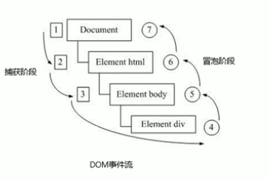
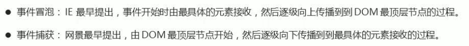
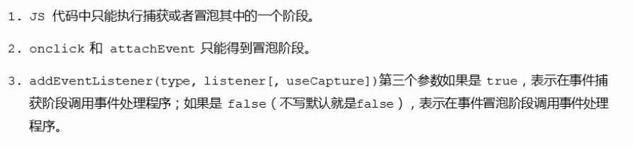
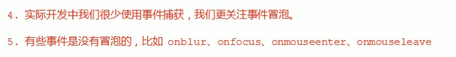
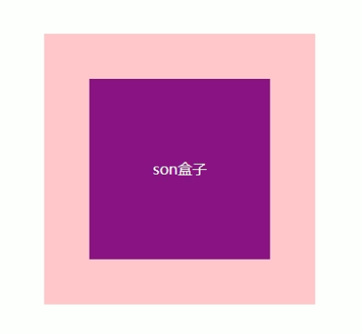
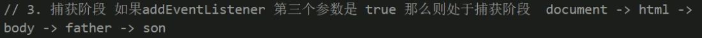
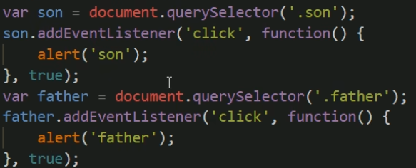
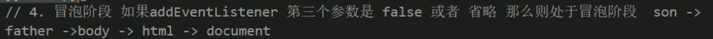
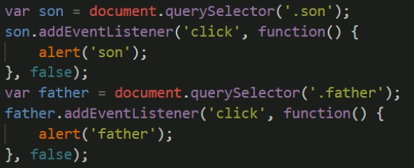

#### DOM事件流

---

##### 理论

事件流：从页面中接收事件的顺序

 

捕获阶段：从 **1->2->3**直到找到，在过程中，有处理程序就执行，没有就下一层

冒泡阶段：从 **4->3->2->1** 直到到达最大的板块

 

---

##### 代码验证

 

 

取决于**addEventListener**的第三个参数，第三个参数为true时，则处于捕获阶段。

 

---

###### 捕获阶段

 

 

点击**son盒子**时，由于捕获阶段是由最外层元素开始，所以，先弹出father再弹出son。

----

###### 冒泡阶段

 

 

点击**son盒子**时，冒泡阶段先从son开始，然后到最外层的元素