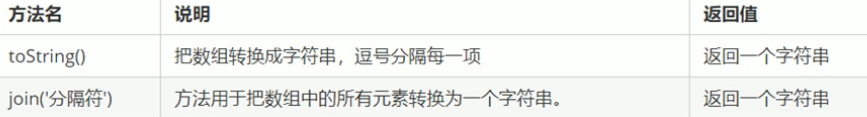

##### 字符型string

检测长度length：console.log(**str.length**)；//此处str是 var str （一个变量）

~~~js
console.log(str.length)
//返回字符串的str的长度
~~~

###### 字符串拼接

**+** 可以将字符串拼接

例：console.log('字符串1'+'字符串2')；

引入变量进入字符串： console.log('字符串1'+变量+'字符串2')；

变量+字符串变成字符串

例如：

~~~js
var variable=undefined；

console.log(variable+'abc');   //结果为variableabc

console.log(variable+1);   //结果为NaN，undefined和 数字 相加最终得出 非数字

var space=null;

console.log(space+'null');  //结果为spacenull

console.log(space+1); //结果为1，null参与运算时可视为0
~~~

**单独转换而不添加**

~~~js
var num=10；

console.log(num+'');  //加个空即可
~~~

###### 转换为字符串

toString（变量） 可将变量转化为字符串  例： 

~~~js
var num=1； 
alert(num.toString());
//输出结果为'1'
~~~

强制转换String(变量) 例： 

~~~js
var num=10; 
alert(String(num));
//输出结果为字符'10'
~~~

转换字符串： 

 