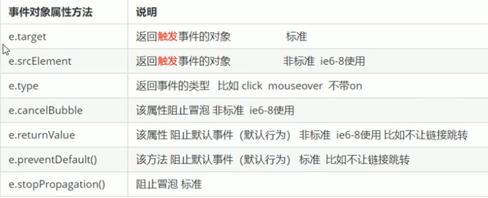

#### 事件对象

##### 写法

~~~js
var div = document.querySelector('div');
//第一种
div.onclick=function()
{
    console.log(event);
    //输出一系列相关数据的集合
}
//第二种
div.addEventListener('click',function(event){
    console.log(event);
    //同样的效果
})
//事件对象可以自行命名
//第二种方式存在兼容性问题，ie 6 7 8通过window.event(改名只能改成这个)
~~~

兼容性写法

~~~js
var div = document.querySelector('div');
div.onclick=function(e)
{
    e=e||window.event;
    console.log(e);
    console.log(window.event);
}
~~~

----

##### 常见属性和方法

 

###### e.target

获取触发目标

~~~js
var div = document.querySelector('div'); 
div.addEventListener('click',function(e){
    console.log(e.target);
    //返回触发对象，即div
    console.log(this);
    //返回相同，但this是返回绑定的对象，而target返回触发对象
    console.log(e.currentTarget);
    //与this相似的属性：currentTarget(当前绑定的对象)
})

var ul = document.querySelector('ul'); 
div.addEventListener('click',function(e){
    console.log(e.target);
    //返回li而不是ul
    console.log(this);
    //返回ul
})

//兼容性写法
div.onclick=function(e)
{
    e=e||window.event;
    var target=e.target||e.srcElement;
}

~~~

###### e.type

获取目标类型

~~~js
var div = document.querySelector('div'); 
div.addEventListener('click',fn);
div.addEventListener('mouseover',fn);
div.addEventListener('mouseout',fn);
function fn(e)
{
    console.log(e.type);
    //返回触发对象，即div
}
~~~

###### e.preventDefault

阻止默认行为

~~~js
var a = document.querySelector('a'); 
div.addEventListener('click',function(e){
    e.preventDefault();
})
//以上ie不支持，需要写个兼容性方案
a.onclick=function(e)
{
    e=preventDefault();
    //普通浏览器
    e.returnValue;
    //ie678
    return false；
    //return 通用，都是会阻断程序
}
~~~

###### e.stopPropagation

阻止冒泡

~~~js
var father=document.querySelector('.father');
var son=document.querySelector('.son');
son.addEventListener('click',function(e){
    e=e||window.element;
    alert("son");
   	e.stopPropagation();
    //在son处停止传播，ie不支持
    e.cancelBubble=true;
    //ie支持这个
},false);
father.addEventListener('click',function(e){
    alert("father");
},false);
//冒泡：先弹出son，然后弹出father。
//在son加入冒泡阻断后就不再上传了
~~~

###### 事件委托

~~~js
var ul = document.querySelector('ul'); 
div.addEventListener('click',function(e){
    alert('');
    //点击子节点冒泡到父节点使用同一的功能
    e.target.style.backgroundColor='skyblue';
    //通过获取触发目标，改变子元素属性
})
~~~

