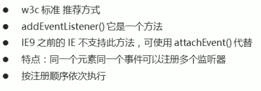

### 注册事件

方式：

1.传统方式  2.方法监听注册方式

---

#### 传统

以**on**开头

 

同时只能处理一个函数，无法应用到其他的同类函数。

 

当同时对一个元素绑定事件时，只会执行一个事件(最下方)。

---

#### 方法监听方式

  

##### addEventListener

**eventTarget.addEventListener(type, listener[ , useCapture])**

type: 事件类型字符串，click，mouseover等，不用带on

listener: 事件处理函数，事件发生时调用

useCapture:布尔值，默认为false。

示范：

~~~js
var btns=document.querySelectorAll('button');
btns[1].addEventListener('click',function(){})
//事件类型是字符串
~~~

 

 

 使用监听器可以给同一个元素添加多个事件。

----

##### attachEvent

**了解**，有版本(ie 8及以前)要求。

**eventTarget.attachEvent(eventNameWithOn, callback)**

eventNameWithOn：事件处理字符串

callback：事件处理函数

~~~js
var btns=document.querySelectorAll('button');
btns[1].attachEvent('onclick',function(){})
//事件类型是字符串
~~~

 

##### 兼容性解决方案

 

~~~js
function addEventListener(element,eventName,fn)
{
    if(element.addEventListener)
    {
        element.addEventListener(eventName,fn);
	}
    else if(element.attachEvent)
    {
        element.attachEvent('on'+eventName,fn);
    }
    else 
    {
        element.['on'+eventName]=fn;
    }
}
//element：绑定元素，eventName:事件名，fn：对应事件函数
~~~

