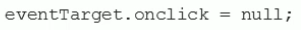
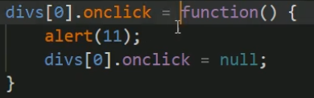
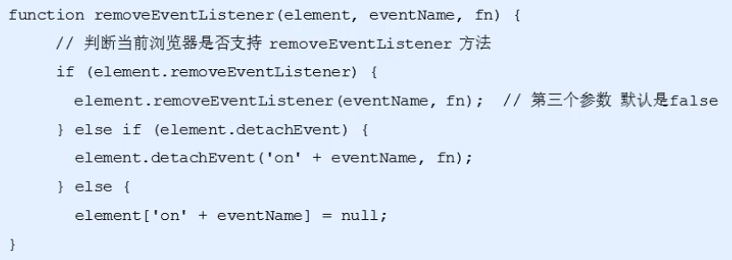

### 解绑事件

方式：1. 传统 2.方法监听注册

---

#### 传统解绑事件

 

**element.onclick=null**

 

~~~js
var divs=document.querySelectorAll('div');
divs[0].conclick=function()
{
	divs[0].onclick=null;
    //点击一次后解绑
}
~~~

---

#### 方法监听方法

##### removeEventListener

**eventTarget.removeEventListener(type, listener[ , useCapture])**

type: 事件类型字符串，click，mouseover等，不用带on

listener: 事件处理函数，事件发生时调用

useCapture:布尔值，默认为false。

~~~js
var divs=document.querySelectorAll('div');
divs[1].addEventListener('click',fn);
function fn()
{
    divs[1].removeEventListener('click',fn);
}
~~~

##### detachEvent

版本要求(ie 8以后)

eventTarget.detachEvent(eventNameWithOn, callback)

eventNameWithOn：事件处理字符串

callback：事件处理函数

~~~js
var divs=document.querySelectorAll('div');
divs[2].detachEvent('onclick',fn1);
function fn1()
{
    divs[2].detachEvent('onclick',fn1);
}
~~~

##### 兼容性解决方案

 

~~~js
function addEventListener(element,eventName,fn)
{
    if(element.addEventListener)
    {
        element.removeEventListener(eventName,fn);
	}
    else if(element.attachEvent)
    {
        element.detachEvent('on'+eventName,fn);
    }
    else 
    {
        element.['on'+eventName]=null;
    }
}
//element：绑定元素，eventName:事件名，fn：对应事件函数
~~~

