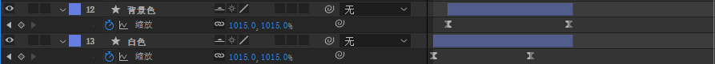
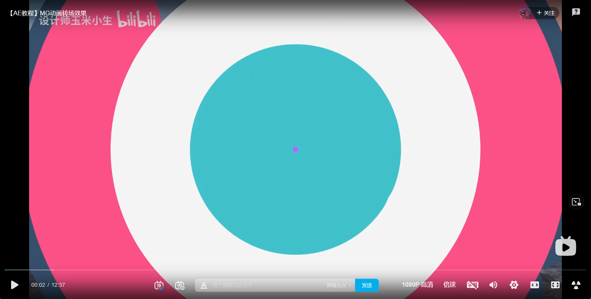

#### 同圆

两个不同颜色的圆在不同时间段进行缩放动画，能产生后一个（时间靠后）圆追上前一个圆覆盖的动画

多叠加即可多层，其他出现消失动画也能如此操作（较麻烦）

#### 中心消失

从中心消失动画，采用合并路径更为便捷

#### 通用MG动画转场

 第一个：<a href="https://www.bilibili.com/video/BV1f64y1Z7d5?spm_id_from=333.337.search-card.all.click">转场</a> 

从中心冒出不同色调的圆形

 

使用功能模块(预测)：修剪路径，无填充但描边很高的圆(图形)，缩放动画。

#### 文字效果

 <a href="https://www.bilibili.com/video/BV1uW411i7Ka?p=5">文字效果</a> 教程

